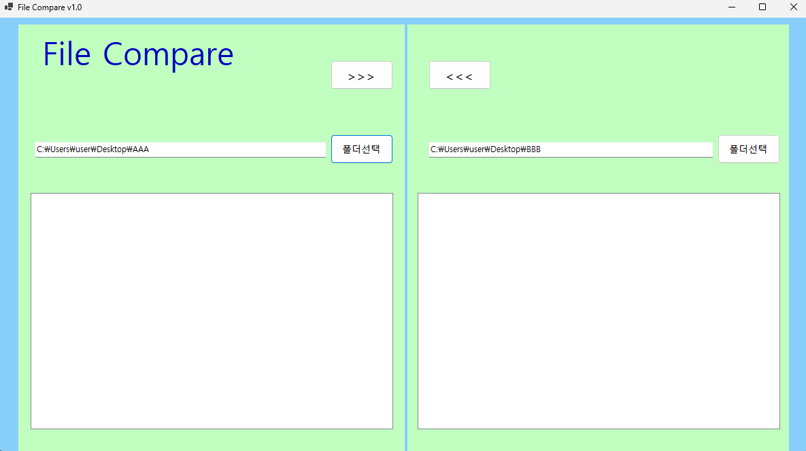
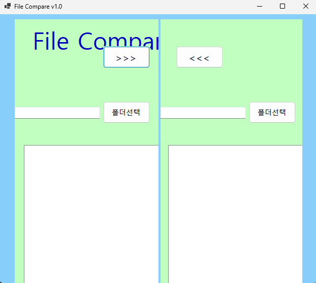
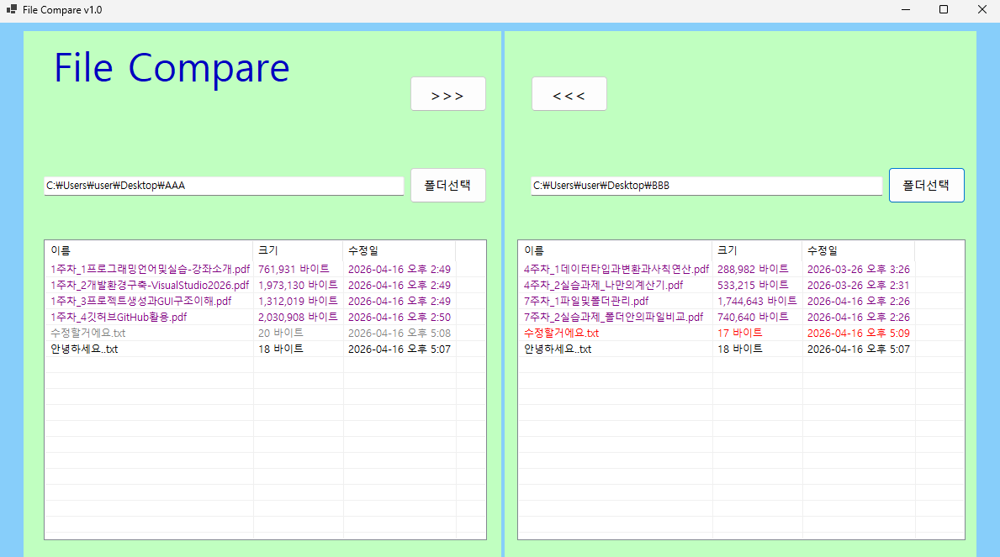
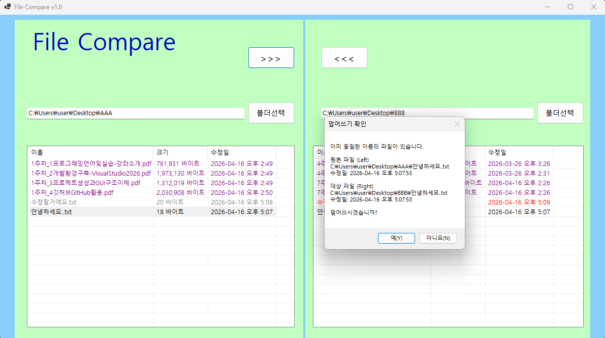

# (C# 코딩) FileCompare

## 개요

-C# 프로그래밍 학습
-1줄 소개: 두 개의 폴더를 선택하여 파일 목록을 확인하고 비교할 수 있는 프로그램

---

## 사용한 플랫폼

-C#
  -.NET Windows Forms
  - Visual Studio
  - GitHub

---

## 사용한 컨트롤

- Label
- TextBox
- Button
- ListView
- SplitContainer
- Panel

---

## 사용한 기술과 구현한 기능

- Visual Studio를 이용한 UI 디자인
- SplitContainer를 이용한 좌/우 화면 분할 구성
- Panel을 이용한 UI 구조 정리
- TextBox를 이용한 폴더 경로 입력 영역 구현
- Button을 이용한 폴더 선택 및 기능 버튼 배치
- ListView를 이용한 파일 목록 표시 영역 구성 (추후 기능 확장 예정)
- Dock 속성을 이용한 화면 자동 크기 조절 구현
- Anchor 속성을 이용한 창 크기 변경 시 UI 유지 기능 구현
- 버튼 클릭 이벤트 연결 및 기본 동작 확인

---

## 실행화면

-과제1 코드의 실행 스크린샷

- 과제 내용
  - 파일 비교 프로그램의 기본 UI를 구성하고, 좌측과 우측 폴더를 선택하여 파일을 비교할 수 있는 기반 구조를 구현한다.

- 구현 내용과 기능 설명
  - UI 구성
    - Label: 프로그램 제목(File Compare) 표시
    - TextBox: 좌측/우측 폴더 경로 입력
    - Button: 폴더 선택 버튼 및 파일 복사 버튼 배치
    - ListView: 좌/우 파일 목록 표시 영역
    - SplitContainer: 화면을 좌/우로 분할
    - Panel: UI 요소들을 기능별로 정리

- 화면 분할 구조
  - SplitContainer를 사용하여 좌측과 우측 영역을 나누고 각각 독립적으로 구성
  - 각 영역에 Panel을 배치하여 컨트롤을 체계적으로 정리

- 컨트롤 설정
  - Dock 속성을 사용하여 화면 크기에 맞게 컨트롤이 자동으로 확장되도록 설정
  - Anchor 속성을 설정하여 창 크기 변경 시에도 UI가 깨지지 않도록 구성

- 기본 동작 확인
  - 버튼 클릭 이벤트가 정상적으로 연결되는지 확인
  -  프로그램 실행 시 UI가 정상적으로 출력되는지 테스트 완료

## 실행 화면 (과제2)

- 코드의 실행 스크린샷과 구현 내용 설명
  

-  과제 내용
    - 폴더 선택 기능과 파일 리스트 기능 구현 (색상 구분 표시)
    - 양쪽 폴더의 파일 목록을 ListView에 출력
    - 파일 비교 결과를 색상으로 구분하여 표시

- 구현한 내용 (위 그림 참조)

- 폴더 선택 기능
  - FolderBrowserDialog를 사용하여 사용자가 원하는 폴더를 선택하도록 구현
  - 선택한 경로를 TextBox에 표시

- 파일 및 폴더 목록 출력
  - Directory.EnumerateDirectories, EnumerateFiles를 사용하여 폴더 및 파일 목록을 가져옴
  - ListView 컨트롤에 이름, 크기, 수정일 정보를 표 형태로 출력
  - View = Details, GridLines, FullRowSelect 속성을 설정하여 가독성 향상

- 파일 비교 기능 구현
  - 파일 이름을 기준으로 양쪽 폴더의 파일 존재 여부를 비교
  - 동일한 파일일 경우 수정시간을 기준으로 최신/이전 파일을 판별

- 색상 구분 표시 기능
  - 동일 파일 → 양쪽 모두 검정색
  - 수정된 파일 → 최신(New)은 빨간색, 이전(Old)은 회색
  - 한쪽에만 존재하는 파일 → 보라색

- 양쪽 폴더를 동시에 비교하여 파일 상태를 시각적으로 확인할 수 있도록 구현

## 실행 화면 (과제3)

- 코드의 실행 스크린샷과 구현 내용 설명
  

- 과제 내용

  - 양쪽 폴더 사이에서 파일의 복사 기능 구현
  - 선택한 파일을 반대쪽 폴더로 복사
  - 수정된 날짜 정보를 확인하여 덮어쓰기 여부를 사용자에게 확인받고 진행

- 구현한 내용 (위 그림 참조)

- 파일 선택 및 복사 기능 구현

  - ListView의 SelectedItems를 사용하여 선택한 파일 목록을 가져옴
  - 선택한 파일을 기준으로 반대쪽 폴더로 복사하도록 구현

- 파일 경로 생성

  - Path.Combine을 사용하여 원본 경로(srcPath)와 대상 경로(destPath)를 생성

- 파일 존재 여부 확인 및 예외 처리

  - File.Exists를 사용하여 대상 파일 존재 여부 확인
  - 존재하지 않는 파일은 복사 대상에서 제외하도록 처리

- 덮어쓰기 확인 기능 구현

  - 대상 폴더에 동일한 파일이 존재할 경우 MessageBox를 통해 사용자에게 덮어쓰기 여부를 확인
  - 사용자가 ‘아니오’를 선택하면 해당 파일은 복사하지 않도록 구현

- 파일 날짜 정보 표시 기능 (추가 구현)

  - File.GetLastWriteTime을 사용하여 원본 파일과 대상 파일의 수정 날짜 정보를 가져옴
  - 덮어쓰기 확인 창에 양쪽 파일의 경로 및 수정일을 함께 표시하여 사용자가 판단할 수 있도록 구현

- 복사 기능 구현

  * File.Copy를 사용하여 파일 복사 수행 (덮어쓰기 허용)

- 복사 후 화면 갱신

  - PopulateListView를 다시 호출하여 양쪽 ListView를 갱신하고 색상 비교 결과를 반영하도록 구현
